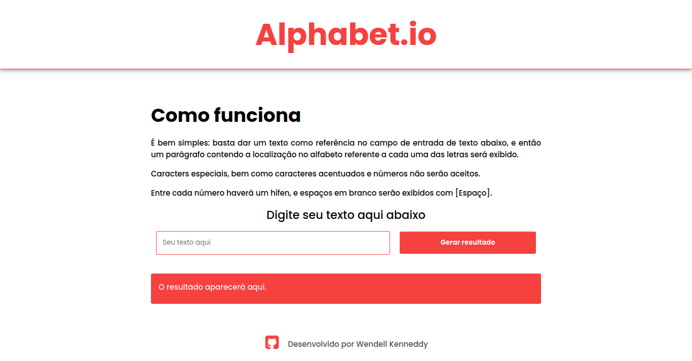

# 

---

## :bookmark_tabs: Tabela de Conteúdo

- [:closed_book: Sobre](#closed_book-sobre)
- [:hammer_and_pick: Tecnologias Utilizadas](#hammer_and_pick-tecnologias-utilizadas)
- [:sparkles: Features](#sparkles-features)
- [:handshake: Seja um contribuidor](#handshake-seja-um-contribuidor)

---

## :closed_book: Sobre

Uma simples aplicação que converte texto em números, sendo cada número a locaização no alfabeto de cada letra.

Basta digitar seu texto e utilizar o botão logo ao lado, e então uma cadeia de números aparecerá.

---

## :hammer_and_pick: Tecnologias Utilizadas

- Visual Studio Code (Editor de código)
- HTML5
- JavaScript
- SCSS (convertido para CSS)

--- 

## :sparkles: Features

- Criação de uma string contendo números referentes a localização no alfabeto de cada caractere da string dada pelo usuário.
- Responsividade

## :handshake: Seja um contribuidor:

Teve uma ideia ou notou algo que poderia melhorar ainda mais o projeto, e deseja implementar? É simples!

1. Faça fork do projeto
2. Aplique suas mudanças
3. Crie um Pull Request com suas implementações
